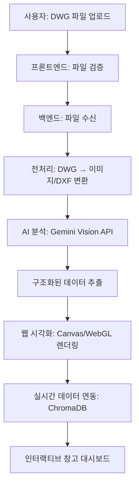

# 🏗️ VSS 과제 Step 3: DWG CAD 시각화 구현 계획

## 📋 과제 문제 분석

### **🚨 현재 상황**

- **DWG 파일 부재**: VSS에서 제공된 DWG CAD 파일이 없음
- **웹 호환성 문제**: DWG는 바이너리 형식으로 웹에서 직접 처리 어려움
- **창고 도면 필요**: 실제 창고 레이아웃 시각화가 과제 요구사항
- **실시간 데이터 연동**: 재고 현황과 CAD 도면 연동 필요

### **🎯 과제 목표**

1. **DWG 파일 업로드 기능** 구현
2. **CAD 데이터 AI 분석** 및 해석
3. **웹 기반 시각화** 대안 제공
4. **실시간 재고 데이터 연동**
5. **인터랙티브 창고 관리** 인터페이스

## 🔧 해결 방법

### **접근 전략**

1. **DWG → 중간 형식 변환** (DXF, SVG, JSON)
2. **AI 기반 도면 해석** (Gemini Multimodal)
3. **Canvas/WebGL 시각화** 구현
4. **실제 데이터 오버레이** (ChromaDB 연동)

### **기술 스택**

- **Frontend**: Canvas API, Three.js, Fabric.js
- **Backend**: Python (ezdxf, PIL, OpenCV)
- **AI**: Gemini Vision API (이미지 분석)
- **데이터**: ChromaDB RAG 시스템 연동

## 🎯 사용자 플로우



---

# 📝 TO-DO LIST

## 🏗️ Phase 1: 기반 구조 구축

### **📤 1-1. 프론트엔드 파일 업로드**

- [ ] **DWG 파일 드래그앤드롭 UI** 구현
  - [ ] `index.html`에 파일 업로드 섹션 추가
  - [ ] 파일 타입 검증 (`.dwg`, `.dxf`, `.dwf`)
  - [ ] 파일 크기 제한 (최대 50MB)
  - [ ] 업로드 진행률 표시
  - [ ] 에러 처리 및 사용자 피드백

```html
<!-- 구현 예시 -->
<div id="dwgUploadSection" class="upload-container">
  <div class="upload-dropzone" id="dwgDropzone">
    <i class="fas fa-upload"></i>
    <p>DWG/DXF 파일을 드래그하거나 클릭하여 업로드</p>
    <input type="file" id="dwgFileInput" accept=".dwg,.dxf,.dwf" />
  </div>
</div>
```

### **🔄 1-2. 백엔드 파일 수신**

- [ ] **FastAPI 파일 업로드 엔드포인트** 구현
  - [ ] `/api/cad/upload` POST 엔드포인트 추가
  - [ ] 파일 저장 로직 (임시 저장소)
  - [ ] 파일 메타데이터 추출
  - [ ] 비동기 처리 큐 설정

```python
# 구현 예시
@app.post("/api/cad/upload")
async def upload_dwg_file(file: UploadFile):
    # 파일 검증 및 저장
    file_path = await save_uploaded_file(file)
    # 비동기 처리 큐에 추가
    task_id = await process_dwg_async(file_path)
    return {"task_id": task_id, "status": "processing"}
```

## 🔧 Phase 2: DWG 파일 전처리

### **🛠️ 2-1. DWG 파일 변환**

- [ ] **Python 변환 모듈** 구현
  - [ ] DWG → DXF 변환 (`ezdxf` 라이브러리)
  - [ ] DWG → 이미지 변환 (PNG, SVG)
  - [ ] 메타데이터 추출 (레이어, 객체 정보)
  - [ ] 좌표계 정규화

```python
# requirements.txt 추가
# ezdxf
# Pillow
# cairosvg
# matplotlib
```

- [ ] **변환 서비스 클래스** 작성
  - [ ] `app/services/cad_conversion_service.py`
  - [ ] DWG 파일 분석 함수
  - [ ] 좌표 추출 함수
  - [ ] 객체 분류 함수 (벽, 문, 랙 등)

### **🖼️ 2-2. 이미지 전처리**

- [ ] **OpenCV 이미지 처리**
  - [ ] 이미지 품질 향상
  - [ ] 윤곽선 추출
  - [ ] 텍스트 영역 분리
  - [ ] AI 분석용 포맷 최적화

## 🤖 Phase 3: AI 분석 및 해석

### **👁️ 3-1. Gemini Vision API 통합**

- [ ] **멀티모달 AI 분석** 구현
  - [ ] 이미지 → Gemini Vision API 전송
  - [ ] 도면 구조 분석 프롬프트 최적화
  - [ ] 객체 인식 (랙, 통로, 출입구, 사무실)
  - [ ] 좌표 및 치수 추출

```python
# 구현 예시
async def analyze_cad_with_gemini(image_path: str):
    prompt = """
    이 창고 도면을 분석하고 다음 정보를 JSON 형태로 추출해주세요:
    1. 랙 위치 및 크기 (좌표, 너비, 높이, ID)
    2. 통로 경로 (시작점, 끝점, 폭)
    3. 출입구 위치 (좌표, 크기, 방향)
    4. 전체 창고 크기 (너비, 높이)
    5. 기타 시설 (사무실, 화장실, 계단 등)
    """
    # Gemini Vision API 호출
```

### **📊 3-2. 구조화된 데이터 생성**

- [ ] **CAD 데이터 모델** 정의
  - [ ] `app/models/cad_models.py` 추가
  - [ ] 창고 레이아웃 데이터 클래스
  - [ ] 랙, 통로, 구역 정보 모델
  - [ ] 좌표계 변환 함수

```python
# 데이터 모델 예시
@dataclass
class WarehouseLayout:
    width: float
    height: float
    racks: List[Rack]
    aisles: List[Aisle]
    gates: List[Gate]

@dataclass
class Rack:
    id: str
    x: float
    y: float
    width: float
    height: float
    capacity: int
```

## 🎨 Phase 4: 웹 시각화 구현

### **🖼️ 4-1. Canvas 기반 2D 렌더링**

- [ ] **Canvas 렌더링 엔진** 구현
  - [ ] `static/js/cad_renderer.js` 추가
  - [ ] 창고 레이아웃 그리기 함수
  - [ ] 줌/팬 기능 구현
  - [ ] 레이어 관리 (배경, 랙, 라벨)

```javascript
// 구현 예시
class WarehouseRenderer {
  constructor(canvasId) {
    this.canvas = document.getElementById(canvasId);
    this.ctx = this.canvas.getContext("2d");
    this.scale = 1;
    this.offsetX = 0;
    this.offsetY = 0;
  }

  drawRack(rack) {
    // 랙 그리기 로직
  }

  drawAisle(aisle) {
    // 통로 그리기 로직
  }
}
```

### **⚡ 4-2. 인터랙티브 기능**

- [ ] **사용자 상호작용** 구현
  - [ ] 랙 클릭 시 상세 정보 표시
  - [ ] 재고 현황 오버레이
  - [ ] 입출고 동선 애니메이션
  - [ ] 검색 및 필터링

### **🌐 4-3. Three.js 3D 시각화 (선택사항)**

- [ ] **3D 창고 뷰어** 구현
  - [ ] Three.js 기반 3D 렌더러
  - [ ] 카메라 컨트롤
  - [ ] 3D 랙 모델링
  - [ ] 조명 및 재질 설정

## 🔗 Phase 5: 실시간 데이터 연동

### **📊 5-1. ChromaDB 통합**

- [ ] **CAD 데이터 벡터화**
  - [ ] 창고 레이아웃 정보 ChromaDB 저장
  - [ ] 랙-재고 데이터 매핑
  - [ ] 공간 기반 검색 구현
  - [ ] 실시간 재고 업데이트

### **🔄 5-2. 실시간 동기화**

- [ ] **WebSocket 연결** (선택사항)
  - [ ] 실시간 재고 변화 반영
  - [ ] 입출고 이벤트 시각화
  - [ ] 경고 알림 시스템

## 📱 Phase 6: UI/UX 개선

### **🎨 6-1. 대시보드 통합**

- [ ] **CAD 뷰어 대시보드 통합**
  - [ ] `index.html`에 CAD 섹션 추가
  - [ ] 탭 인터페이스 구현
  - [ ] 반응형 레이아웃 적용
  - [ ] 로딩 상태 표시

```html
<!-- UI 구조 예시 -->
<div class="cad-dashboard">
  <div class="cad-controls">
    <button id="uploadDwgBtn">DWG 업로드</button>
    <button id="toggleLayersBtn">레이어 토글</button>
    <button id="zoomFitBtn">전체 보기</button>
  </div>
  <div class="cad-viewer">
    <canvas id="warehouseCanvas"></canvas>
  </div>
  <div class="cad-info-panel">
    <!-- 선택된 랙 정보 표시 -->
  </div>
</div>
```

### **📱 6-2. 모바일 최적화**

- [ ] **터치 제스처** 지원
  - [ ] 핀치 줌 구현
  - [ ] 터치 드래그 팬
  - [ ] 모바일 UI 조정

## 🧪 Phase 7: 테스트 및 최적화

### **🔬 7-1. 기능 테스트**

- [ ] **엔드투엔드 테스트**
  - [ ] DWG 업로드 → 시각화 전체 플로우
  - [ ] 다양한 DWG 파일 포맷 테스트
  - [ ] 대용량 파일 처리 테스트
  - [ ] 에러 케이스 처리 검증

### **⚡ 7-2. 성능 최적화**

- [ ] **렌더링 최적화**
  - [ ] Canvas 렌더링 성능 튜닝
  - [ ] 메모리 사용량 최적화
  - [ ] 파일 처리 속도 개선
  - [ ] 캐싱 전략 구현

## 🚀 Phase 8: 데모 및 문서화

### **📖 8-1. 문서 작성**

- [ ] **사용자 가이드** 작성
  - [ ] DWG 파일 업로드 방법
  - [ ] 기능별 사용법 설명
  - [ ] 지원 파일 형식 안내
  - [ ] 문제 해결 가이드

### **🎬 8-2. 데모 준비**

- [ ] **시연용 DWG 파일** 준비
  - [ ] 샘플 창고 도면 생성
  - [ ] 다양한 복잡도의 테스트 케이스
  - [ ] 실제 데이터와 연동된 시연

---

## 📅 일정 계획

| Phase       | 예상 소요 시간 | 우선순위  |
| ----------- | -------------- | --------- |
| **Phase 1** | 1-2일          | 🔴 High   |
| **Phase 2** | 2-3일          | 🔴 High   |
| **Phase 3** | 2-3일          | 🔴 High   |
| **Phase 4** | 3-4일          | 🟡 Medium |
| **Phase 5** | 1-2일          | 🟡 Medium |
| **Phase 6** | 2-3일          | 🟢 Low    |
| **Phase 7** | 1-2일          | 🟡 Medium |
| **Phase 8** | 1일            | 🟢 Low    |

**전체 예상 소요 시간: 13-20일**

## 🛠️ 필요한 추가 패키지

### **Python (requirements.txt)**

```txt
ezdxf>=1.1.0
Pillow>=10.0.0
opencv-python>=4.8.0
cairosvg>=2.7.0
matplotlib>=3.7.0
shapely>=2.0.0
```

### **JavaScript (CDN/NPM)**

```html
<!-- Three.js (3D 시각화용) -->
<script src="https://cdnjs.cloudflare.com/ajax/libs/three.js/r150/three.min.js"></script>

<!-- Fabric.js (Canvas 조작용) -->
<script src="https://cdnjs.cloudflare.com/ajax/libs/fabric.js/5.3.0/fabric.min.js"></script>
```

## 🎯 성공 기준

### **MVP (Minimum Viable Product)**

- ✅ DWG 파일 업로드 기능
- ✅ 기본적인 도면 시각화
- ✅ 랙 위치 표시
- ✅ 재고 정보 오버레이

### **완성 목표**

- ✅ AI 기반 자동 도면 분석
- ✅ 인터랙티브 3D 시각화
- ✅ 실시간 데이터 연동
- ✅ 모바일 친화적 UI

---

**🏆 VSS 과제 Step 3: DWG CAD 시각화 완성을 위한 체계적 접근**  
_AI-Powered CAD Analysis + Web Visualization + Real-time Data Integration_
