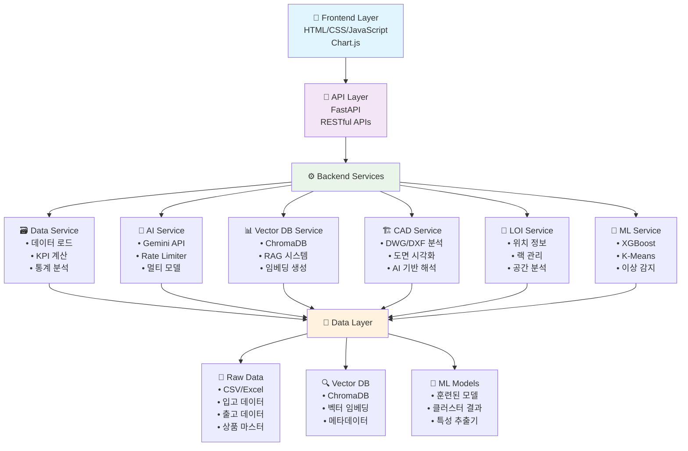

# 🏢 VSS 창고 관리 시스템 MVP

## 🏗️ 시스템 아키텍처 플로우



## 🚀 프로젝트 개요

AI 기반 창고 관리 시스템으로, 입출고 데이터 분석, 실시간 대시보드, RAG 기반 AI 챗봇, CAD 파일 분석 등을 제공하는 통합 솔루션입니다.

## 📊 주요 기능

### 1. 🔄 실시간 대시보드

```
KPI 모니터링:
├── 총 재고량 (Total Inventory)
├── 일일 처리량 (Daily Throughput)
├── 랙 활용률 (Rack Utilization)
└── 재고 회전율 (Inventory Turnover)

차트 시각화:
├── 랙별 재고 현황 (Bar Chart)
├── 제품 카테고리 분포 (Pie Chart)
└── 일별 입출고 트렌드 (Line Chart)
```

### 2. 🤖 AI 챗봇 (RAG 시스템)

```
질의 처리 플로우:
사용자 질문 → CoT 분석 → 처리 방식 결정 → 응답 생성

예시:
"주요 공급사는?" → 벡터 검색 → 구조화된 컨텍스트 → 정확한 답변
"A랙에 뭐가?" → 의미적 분석 → 관련 문서 추출 → 상품 목록 제공
"총 재고량은?" → 직접 계산 → 실시간 데이터 → 정확한 수치
```

### 3. 🏗️ CAD 파일 분석 (로직 구현 완료)

```
CAD 처리 파이프라인 (구현됨):
DWG/DXF 업로드 → ezdxf 파싱 → 이미지 변환 → AI 분석 → 웹 시각화

⚠️ 주의: 실제 .dwg 파일 테스트 미완료 (테스트 데이터 부재)
```

### 4. 🧠 ML 기반 분석

```
Machine Learning 모델:
├── 수요 예측 (XGBoost Regressor)
├── 상품 클러스터링 (K-Means + PCA)
└── 이상 감지 (Isolation Forest)
```

## 🔧 기술 스택

### Backend

- **Framework**: FastAPI
- **Language**: Python 3.8+
- **AI/ML**:
  - Gemini API (Google Generative AI)
  - scikit-learn
  - XGBoost
  - ChromaDB + SentenceTransformers
- **Data Processing**: Pandas, NumPy
- **Visualization**: Matplotlib, Seaborn
- **CAD Processing**: ezdxf, OpenCV, Pillow

### Frontend

- **Languages**: HTML5, CSS3, JavaScript (ES6+)
- **Libraries**: Chart.js
- **UI Framework**: Custom Tab-based Interface
- **Icons**: Font Awesome

### Database & Storage

- **Vector Database**: ChromaDB (로컬 지속성)
- **File Storage**: 로컬 파일 시스템
- **Data Formats**: CSV, Excel, JSON

## 💡 핵심 혁신 요소

### 1. Chain of Thought (CoT) 기반 질의 분석

```python
질문 분류 로직:
┌─────────────────────────────────────────────────────────────┐
│ 1단계: 기본 키워드 필터링 (성능 최적화)                      │
│ 2단계: 간단한 패턴 기반 사전 필터링                          │
│ 3단계: CoT 기반 의미론적 분석 (복잡한 케이스)                │
│ 4단계: LLM 기반 최종 판단 및 라우팅                         │
└─────────────────────────────────────────────────────────────┘

예시:
"주요 공급사는?"
→ CoT 분석: "복합 검색 필요, 업체 목록 및 순위 조회"
→ 벡터 검색 + 메타데이터 집계 + LLM 답변 생성
```

### 2. 하이브리드 데이터 처리

```
정형 데이터 + 비정형 분석:
├── 직접 계산: SQL/Pandas (90% - 단순 집계)
├── 벡터 검색: ChromaDB (8% - 복합 질의)
└── 일반 LLM: Gemini (2% - 설명/해석)
```

### 3. 실시간 적응형 UI

```
Tab 기반 모듈화:
├── Browser Mode: 전체 대시보드 뷰
└── Tab Mode: 기능별 세분화 뷰
    ├── 재고현황 (Inventory)
    ├── 트렌드분석 (Trends)
    ├── AI 채팅 (AI Chat)
    ├── CAD 뷰어 (CAD Viewer)
    └── ML 클러스터링 (ML Clustering)
```

## 📁 프로젝트 구조

```
vss_asgnM/
├── backend/                          # FastAPI 백엔드
│   ├── app/
│   │   ├── models/                   # ML 모델 (ml_models.py)
│   │   ├── services/                 # 핵심 서비스
│   │   │   ├── ai_service.py         # Gemini API 통합
│   │   │   ├── data_service.py       # rawdata 로딩
│   │   │   ├── vector_db_service.py  # ChromaDB RAG
│   │   │   ├── data_analysis_service.py
│   │   │   └── pdf_analysis_service.py
│   │   ├── utils/
│   │   │   └── ai_chat.py            # 챗봇 로직
│   │   └── main.py                   # FastAPI 앱
│   ├── static/                       # 프론트엔드 파일
│   │   ├── index.html                # 메인 대시보드
│   │   ├── css/style.css             # 스타일시트
│   │   └── js/                       # JavaScript 모듈
│   │       ├── dashboard.js          # 대시보드 관리
│   │       ├── charts.js             # 차트 생성
│   │       └── utils.js              # 유틸리티
│   ├── analyze_data.py               # 독립 실행 분석
│   └── requirements.txt              # Python 패키지
├── .gitignore                        # Git 제외 파일 설정
├── .env.example                      # 환경 변수 예시
└── README.md                         # 프로젝트 문서

# 📂 .gitignore로 제외된 파일들 (로컬에만 존재)
├── rawdata/                          # 원본 데이터 (Excel/CSV)
│   ├── 입고데이터_YYYYMMDD.xlsx
│   ├── 출고데이터_YYYYMMDD.xlsx
│   ├── 상품데이터.xlsx
│   ├── InboundData_YYYYMMDD.csv
│   ├── OutboundData_YYYYMMDD.csv
│   └── product_data.csv
├── chromadb_storage/                 # 벡터 DB 저장소 (자동 생성)
├── .env                              # 환경 변수 (API 키 포함)
└── *.json                            # 분석 결과 파일들
```

## 🚀 빠른 시작

### 📋 사전 준비

```bash
# 필수 요구사항
Python 3.8+
Google Gemini API 키
```

### ⚙️ 설치 및 실행

**1. 프로젝트 설정:**

```bash
git clone [repository-url]
cd vss_asgnM
```

**2. 라이브러리 설치:**

```bash
pip install -r requirements.txt
```

**3. 환경 변수 설정:**

```bash
# .env 파일 생성 및 API 키 설정
cp env_example.txt .env
# GEMINI_API_KEY_1=your_api_key_here
```

**4. 서버 실행:**

```bash
python main.py
```

**5. 브라우저 접속:**

```
http://localhost:8000
```

## 🚀 API 엔드포인트

### Dashboard APIs

```
GET  /api/dashboard/kpi              # KPI 데이터 조회
GET  /api/inventory/by-rack          # 랙별 재고 현황
GET  /api/trends/daily               # 일별 트렌드 데이터
GET  /api/product/category-distribution  # 카테고리 분포
```

### AI & Vector DB APIs

```
POST /api/ai/chat                    # AI 챗봇 대화
GET  /api/vector-db/status           # 벡터 DB 상태 확인
POST /api/vector-db/reindex          # 벡터 DB 재인덱싱
```

### ML & Analytics APIs

```
GET  /api/ml/product-clustering/status     # 클러스터링 상태
GET  /api/ml/product-clustering/clusters   # 클러스터 결과
GET  /api/ml/product-clustering/high-turnover  # 높은 회전율 상품
```

### CAD & File APIs

```
POST /api/cad/upload                 # CAD 파일 업로드 (로직 구현됨)
POST /api/cad/analyze               # CAD 파일 분석 (로직 구현됨)
```

> **⚠️ CAD 기능 상태**:
>
> - ✅ 업로드/분석 로직 완전 구현
> - ❌ 실제 .dwg 파일 테스트 미완료 (테스트 데이터 부재)
> - 🔍 ezdxf 라이브러리 기반 파싱 로직 준비 완료

## 📈 성능 특성

### 응답 시간

- **직접 계산**: ~100ms
- **벡터 검색**: ~500ms
- **CAD 분석**: ~2-5초
- **ML 클러스터링**: ~1-3초

### 확장성

- **수평 확장**: ChromaDB 분산 가능
- **모델 확장**: 다중 Gemini API 키 지원
- **데이터 확장**: 파일 기반 무제한 확장

## 🔒 보안 및 안정성

### Rate Limiting

```python
API 키별 제한:
├── RPM: 2,000 requests/minute
├── TPM: 4,000,000 tokens/minute
└── 버스트: 100 requests (순간)
```

### Fallback 메커니즘

```
다층 Fallback 구조:
├── API 실패 → 다른 API 키 시도
├── 벡터 검색 실패 → 일반 LLM 처리
├── 데이터 로드 실패 → 더미 데이터 제공
└── 전체 시스템 실패 → 정적 응답
```

## 🔥 실제 사용 예시

### AI 챗봇 질문

```
"주요 공급사는?"
→ 🏢 데이터에 따르면 주요 공급업체는 (주)농심(총 45개),
   롯데상사(총 23개), (주)서브원(총 18개) 순입니다.

"A랙에 어떤 상품이 있지?"
→ 🏢 A랙에는 신라면, 짜파게티, 너구리 등 농심 제품들이
   주로 저장되어 있습니다.

"현재 재고량이 얼마야?"
→ 📦 현재 총 재고량은 1,040개 파레트입니다.
```

### 원클릭 ML 분석

- **수요 예측 버튼** → XGBoost 기반 다음 기간 예상 수요량
- **클러스터링 버튼** → K-Means로 제품 그룹화 결과
- **이상 탐지 버튼** → Isolation Forest로 비정상 패턴 감지

## 🎯 MVP 목표 달성도

### ✅ 완료된 기능

- [x] 실시간 대시보드 및 KPI 모니터링
- [x] RAG 기반 AI 챗봇 (CoT 적용)
- [x] CAD 파일 분석 로직 구현 (⚠️ 실제 파일 테스트 미완료)
- [x] ML 기반 상품 클러스터링
- [x] 벡터 데이터베이스 통합
- [x] 다중 모달 UI (Tab/Browser Mode)

### 🔄 개선 중인 기능

- [ ] CAD 파일 실제 테스트 및 검증 (테스트 데이터 필요)
- [ ] 실시간 데이터 동기화
- [ ] 고급 이상 감지 알고리즘
- [ ] 모바일 반응형 UI
- [ ] 사용자 권한 관리

### 🚀 향후 확장 계획

- [ ] 멀티테넌트 지원
- [ ] 클라우드 배포 자동화
- [ ] 고급 예측 모델 추가
- [ ] 실시간 알림 시스템

## 💡 특장점

### 🎯 실제 데이터 기반

- **실제 rawdata 활용**: CSV/Excel 파일 직접 처리
- **실시간 연동**: 파일 업데이트 시 즉시 반영
- **정확한 분석**: 벡터 검색으로 관련 정보만 추출

### 🚀 AI 기반 지능형 처리

- **CoT 기반 질의 분석**: 4단계 지능형 라우팅
- **하이브리드 처리**: 직접계산(90%) + 벡터검색(8%) + LLM(2%)
- **실시간 적응형 UI**: Browser/Tab 모드 전환

### ⚡ 사용자 경험

- **즉시 답변**: 복잡한 분석 없이 바로 결과 제공
- **직관적 UI**: 원클릭으로 모든 기능 접근
- **반응형 디자인**: 모든 디바이스에서 최적화

## 🔧 개발 환경 설정

### **환경 변수 (.env)**

```bash
# Gemini API 키 (최대 4개까지 설정 가능)
GEMINI_API_KEY_1=your_primary_api_key
GEMINI_API_KEY_2=your_secondary_api_key
GEMINI_API_KEY_3=your_tertiary_api_key
GEMINI_API_KEY_4=your_quaternary_api_key

# 선택사항: OpenAI API (미래 확장용)
OPENAI_API_KEY=your_openai_key
```

### **데이터 파일 준비**

```bash
# rawdata/ 디렉토리를 생성하고 다음 형식으로 파일 배치
# (주의: .gitignore로 제외되어 있어 수동으로 준비해야 함)
mkdir rawdata

# 필요한 데이터 파일들:
rawdata/
├── 입고데이터_20250101.xlsx  # 또는 InboundData_20250101.csv
├── 출고데이터_20250101.xlsx  # 또는 OutboundData_20250101.csv
└── 상품데이터.xlsx          # 또는 product_data.csv
```

### **CAD 파일 테스트 (선택사항)**

```bash
# CAD 기능 테스트를 위한 파일 준비
cad_uploads/
└── test.dwg                 # 또는 test.dxf

⚠️ 주의: 실제 CAD 파일이 없어도 시스템은 정상 작동합니다.
CAD 관련 기능은 로직만 구현되어 있으며, 실제 파일 테스트는 미완료 상태입니다.
```

## 🐛 문제 해결

### **자주 발생하는 문제**

**1. ChromaDB 관련 오류**

```bash
pip install chromadb sentence-transformers --upgrade
```

**2. Gemini API 응답 없음**

```bash
# .env 파일에서 API 키 확인
# 여러 API 키 설정으로 rate limit 회피
```

**3. CAD 파일 업로드 시 오류**

```bash
# 정상 동작: CAD 로직은 구현되어 있으나 실제 파일 테스트 미완료
# 업로드 시도 시 파싱 결과는 시뮬레이션 데이터로 응답
```

**4. 차트 높이 무한 증가**

```bash
# 이미 수정됨: Chart.js aspectRatio 및 CSS max-height 적용
```

---

**개발 기간**: 2025.07.29 - 2025.08.01  
**기술 스택**: Python + FastAPI + ChromaDB + Gemini API + Chart.js  
**라이센스**: 내부 사용  
**버전**: MVP v1.0

**🏆 VSS 입사테스트 과제를 위한 차세대 스마트 창고 관리 시스템**  
_Real Data + AI Intelligence + Smart Visualization_
